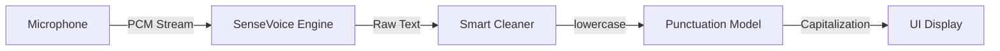

# 🤖 Android-Offline-ASR-TTS-Deploy

A high-accuracy, fully **offline** Android speech assistant project.
It integrates **SenseVoice** (ASR), **MeloTTS** (TTS), and **CT-Transformer** (Punctuation) using [Sherpa-onnx](https://github.com/k2-fsa/sherpa-onnx).

## ✨ Key Features

* **🎙️ High-Accuracy ASR**: Uses Alibaba's **SenseVoiceSmall** model for SOTA offline recognition (Chinese/English/Cantonese/Japanese/Korean).
* **🗣️ Natural TTS**: Uses **MeloTTS** (VITS) for high-quality bilingual speech synthesis.
* **✨ Smart Post-Processing**:
* **Auto-Punctuation**: Restores commas, periods, and question marks using a CT-Transformer model.
* **Hallucination Cleaning**: Automatically removes repeated punctuation (e.g., `??` -> `?`) and fixes logical errors.
* **English Normalization**: Auto-capitalization and format fixes to ensure correct pronunciation.


* **🚀 Production Ready**: Encapsulated in `OfflineSpeechManager` with a clean singleton interface.

## 📥 Model Downloads (Required)

Due to GitHub file size limits, the models are **NOT** included in this repo. You must download them manually and place them in `app/src/main/assets/`.

| Component | Model Name | Download Link | Description |
| --- | --- | --- | --- |
| **ASR** | SenseVoiceSmall | **[Download](https://www.google.com/search?q=https://github.com/k2-fsa/sherpa-onnx/releases/download/sense-voice-models/sherpa-onnx-sense-voice-zh-en-ja-ko-yue-2024-07-17.tar.bz2)** | High accuracy, supports 5 languages. |
| **TTS** | MeloTTS (Zh_En) | **[Download](https://github.com/k2-fsa/sherpa-onnx/releases/download/tts-models/vits-melo-tts-zh_en.tar.bz2)** | Bilingual TTS. **Extract and flatten files!** |
| **Punct** | CT-Transformer | **[Download](https://www.google.com/search?q=https://github.com/k2-fsa/sherpa-onnx/releases/download/punctuation-models/sherpa-onnx-punct-ct-transformer-zh-en-vocab272727-2024-04-12.tar.bz2)** | Restores punctuation & capitalization. |

> **Note**: For faster downloads in China, you can use a mirror site (e.g., `https://mirror.ghproxy.com/` + Link).

## 📂 Assets Structure

**⚠️ CRITICAL**: The `assets` folder structure must match exactly.

* **TTS Folder**: Do **NOT** keep the `dict` subfolder. Move `date.fst`, `number.fst`, etc., directly into `assets/tts/`.
* **ASR Folder**: Use `model.int8.onnx` for smaller size.

```text
app/src/main/assets/
├── asr/
│   ├── model.int8.onnx       # From SenseVoice archive
│   └── tokens.txt
│
├── tts/                      # ⚠️ ALL FILES MUST BE IN ROOT OF TTS FOLDER
│   ├── vits-bilingual.onnx   # Renamed from 'model.onnx' in MeloTTS archive
│   ├── tokens.txt
│   ├── lexicon.txt
│   ├── date.fst              # Moved from 'dict' folder
│   ├── number.fst            # Moved from 'dict' folder
│   ├── phone.fst
│   ├── new_heteronym.fst
│   └── jieba.dict.utf8
│
└── punct/
    └── model.onnx            # The 300MB+ punctuation model

```

## 🛠️ Architecture & Logic

This project implements a robust processing pipeline:

### 1. ASR Pipeline (Speech-to-Text)



* **Input**: Records audio until user releases the button.
* **Recognition**: SenseVoice decodes the entire utterance.
* **Cleaning**: Regex removes artifacts (e.g., `<SOS>`, `??`).
* **Punctuation**: The model adds punctuation and fixes English capitalization (e.g., "hello world" -> "Hello world.").

### 2. TTS Pipeline (Text-to-Speech)

* **Normalization**: Converts text to **UPPERCASE** before synthesis. This fixes an issue where the offline lexicon only recognizes capitalized words (e.g., "ok" -> silent, "OK" -> spoken).
* **Synthesis**: Generates audio using VITS architecture.

## 🚀 Usage

### 1. Dependency

Add the `.aar` library to your `app/libs` and `build.gradle`:

```groovy
implementation files('libs/sherpa-onnx-1.12.23.aar') // Or your version

```

### 2. Initialization

Use the singleton manager:

```kotlin
OfflineSpeechManager.init(this, object : SpeechCallback {
    override fun onInitSuccess() { /* Ready */ }
    override fun onInitFail(msg: String) { /* Error */ }
    override fun onASRResult(text: String) { /* Not used here */ }
    override fun onError(msg: String) { /* Error */ }
})

```

### 3. Start ASR (Push-to-Talk)

```kotlin
// On Button Down
OfflineSpeechManager.startListening(this, object : SpeechCallback {
    override fun onASRResult(text: String) {
        textView.text = text // Result comes here after button release
    }
    // ... handle errors
})

// On Button Up
OfflineSpeechManager.stopListening(callback)

```

### 4. Play TTS

```kotlin
OfflineSpeechManager.speak("Hello, welcome to offline AI.")

```

## 📄 License

Apache 2.0

---

**Credits**: Powered by [Sherpa-onnx](https://github.com/k2-fsa/sherpa-onnx) and models from the open-source community.
